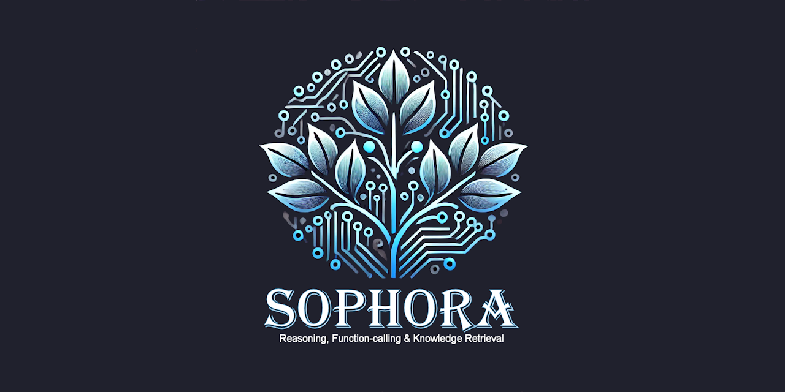

  
[](https://discord.gg/tPWjMwK)
[](https://bsky.app/profile/tinybiggames.com)  

**Sophora** is a local generative AI toolkit for **Delphi**, powered by the **DeepHermes-3** model and the latest **llama.cpp** optimizations. It enables fast, efficient, and unified reasoning, making it ideal for AI-driven applications that require **high-performance local inference** without relying on external cloud services. With features like **function calling**, **embedding generation**, **retrieval-augmented generation (RAG)**, and deep inference capabilities, Sophora provides developers with a versatile and powerful toolset for integrating AI into their Delphi projects. By supporting **optimized execution on modern hardware**, including **compute capability 5.0+ GPUs** via **Vulkan** for acceleration, it ensures smooth and efficient model operations.

## 🚀 Key Features
- **Local AI Inference**: Run **DeepHermes-3** (Llama 3-based) entirely on your machine, enabling fully offline AI capabilities.
- **Fast Token Streaming**: Supports both **non-thinking** (fast response) and **thinking** (deep reasoning) modes.
- **Function Calling & Embeddings**: Execute **function calls** and perform **vector-based search** for advanced AI-driven workflows.
- **Retrieval-Augmented Generation (RAG)**: Enhances AI-generated responses using structured database lookups.
- **SQL and Vector Databases**: Works with **SQLite3** and vector stores, making structured and semantic searches more efficient.
- **Optimized with llama.cpp**: Leverages the latest optimizations for **high performance and reduced memory usage**.
- **Flexible Model Deployment**: Supports various model configurations, letting users balance between performance and accuracy.

## 📥 Getting Started

### 1️⃣ Download and Install Sophora
Get the latest version of Sophora and set up the toolkit:

- Download the latest version from: [Sophora Main ZIP](https://github.com/tinyBigGAMES/Sophora/archive/refs/heads/main.zip) or clone the repository:
  ```sh
  git clone https://github.com/tinyBigGAMES/Sophora.git
  ```
- Extract the contents to your preferred directory.
- Open the project in **Delphi**, and run the provided examples to explore the toolkit. Be sure to reference the **Usage Notes** in `UTestbed.pas` for insights about setup and using the toolkit.
- Ensure your system meets the minimum requirements for running large language models efficiently. Your device will need enough RAM/VRAM to hold the model plus context. Your GPU must have compute capability 5.0+ and support Vulkan for acceleration.

### 2️⃣ Download the Model
Sophora requires **DeepHermes-3**, which can be downloaded from **Hugging Face**:
- [DeepHermes-3-Llama-3-8B-Preview-abliterated-Q4_K_M-GGUF](https://huggingface.co/tinybiggames/DeepHermes-3-Llama-3-8B-Preview-abliterated-Q4_K_M-GGUF/resolve/main/deephermes-3-llama-3-8b-preview-abliterated-q4_k_m.gguf?download=true) (General, Reasoning, Tools)
- [bge-m3-Q8_0-GGUF](https://huggingface.co/tinybiggames/bge-m3-Q8_0-GGUF/resolve/main/bge-m3-q8_0.gguf?download=true) (Embeddings)
- Place the downloaded model in the desired location (default: `C:/LLM/GGUF`).
- Ensure the model file is correctly placed before running the inference engine.

### 3️⃣ Setup Search API (Optional)
To enable web-augmented search capabilities, obtain an API key from [Tavily](https://tavily.com/).

- You receive **1000 free API credits per month**.
- Set an environment variable:
  ```sh
  TAVILY_API_KEY="your_api_key_here"
  ```
- This API can be used for enhanced external queries via tool calls when needed.

## 🛠️ Usage Examples

### 🔹 Basic AI Query (Non-Thinking Mode)
Sophora can generate **fast responses** without deep reasoning.
```delphi
LMsg := TsoMessages.Create();
LInf := TsoInference.Create();
if not LInf.LoadModel() then Exit;
LMsg.Add(soUser, 'Who is Bill Gates?');
if not LInf.Run(LMsg) then
  soConsole.PrintLn(LInf.GetError());
```

### 🔹 Deep Thinking Mode
Sophora enables **multi-step AI reasoning** for complex problem-solving.
```delphi
LMsg.Add(soSystem, 'You are a deep-thinking AI...');
LMsg.Add(soUser, 'Solve this riddle: I walk on four legs in the morning...');
LInf.Run(LMsg);
```

### 🔹 Embedding Generation
Sophora supports **vector search** using LLM embeddings.
```delphi
LInf := TsoInference.Create();
LInf.LoadModel();
LResult := LInf.Embeddings('Explain data analysis in ML');
```

### 🔹 Retrieval-Augmented Generation (RAG)
Store and retrieve **articles** from an SQLite database.
```delphi
LDb := TsoDatabase.Create();
LDb.Open('articles.db');
LDb.ExecuteSQL('INSERT INTO articles VALUES (''AI is transforming industries.'')');
LDb.ExecuteSQL('SELECT * FROM articles');
```

### 🔹 Vector Database Search
Sophora supports **semantic search** over stored documents.
```delphi
LInf := TsoInference.Create();
LInf.LoadModel();
LVectorDB := TsoVectorDatabase.Create();
LVectorDB.Open(LInf, 'vectors.db');
LVectorDB.AddDocument('doc1', 'AI and deep learning research.');
LSearchResults := LVectorDB.Search('machine learning', 3);
```

## 📊 Performance Metrics
Sophora provides **detailed performance tracking**:
- **Input Tokens**: Number of tokens processed.
- **Output Tokens**: Tokens generated by the model.
- **Speed**: Processing speed in tokens per second.

### ✅ Example Performance Output:
```plaintext
Performance:
Input : 15 tokens
Output: 156 tokens
Speed : 49.68 tokens/sec
```

## ⚠️ Repository Status
🚧 **Note:** This repository is currently in the **setup phase**, and full documentation is not yet available. However, the code is fully functional and generally stable. Additional **examples, guides, and API documentation** will be added soon. Stay tuned—this README, along with other resources, will be continuously updated! 🚀

## 📺 Media
🌊 Deep Dive Podcast  
Discover in-depth discussions and insights about Sophora and its innovative features. 🚀✨


https://github.com/user-attachments/assets/6e82bf55-34fc-4085-8f97-0e0faca50a47


## 🛠️ Support and Resources

- 🐞 **Report issues** via the [Issue Tracker](https://github.com/tinyBigGAMES/Sophora/issues).
- 💬 **Engage in discussions** on the [Forum](https://github.com/tinyBigGAMES/Sophora/discussions) and [Discord](https://discord.gg/tPWjMwK).
- 📚 **Learn more** at [Learn Delphi](https://learndelphi.org).

## 🤝 Contributing  

Contributions to **✨ Sophora** are highly encouraged! 🌟  
- 🐛 **Report Issues:** Submit issues if you encounter bugs or need help.  
- 💡 **Suggest Features:** Share your ideas to make **Sophora** even better.  
- 🔧 **Create Pull Requests:** Help expand the capabilities and robustness of the library.  

Your contributions make a difference! 🙌✨

#### Contributors 👥🤝
<br/>

<a href="https://github.com/tinyBigGAMES/Sophora/graphs/contributors">
  
</a>

## 📜 Licensing

**Sophora** is distributed under the **🆓 BSD-3-Clause License**, allowing for redistribution and use in both source and binary forms, with or without modification, under specific conditions.  
See the [📜 LICENSE](https://github.com/tinyBigGAMES/Sophora?tab=BSD-3-Clause-1-ov-file#BSD-3-Clause-1-ov-file) file for more details.

## 💖 Sponsoring

If you find this project useful, please consider [sponsoring this project](https://github.com/sponsors/tinyBigGAMES). Your support helps sustain development, improve features, and keep the project thriving.

If you're unable to support financially, there are many other ways to contribute:
- ⭐ **Star the repo** – It helps increase visibility and shows appreciation.
- 📢 **Spread the word** – Share the project with others who might find it useful.
- 🐛 **Report bugs** – Help improve the project by identifying and reporting issues.
- 🔧 **Submit fixes** – Found a bug? Fix it and contribute!
- 💡 **Make suggestions** – Share ideas for improvements and new features.

Every contribution, big or small, helps make this project better. Thank you for your support! 🚀


---

🛠️ Sophora AI Toolkit – A Powerful Local AI Framework for Delphi with Fast Token Streaming, Deep Reasoning, RAG, and Vector Search! 🚀🤖

<p align="center">

</p>
<h5 align="center">
  
Made with ❤️ in Delphi  


